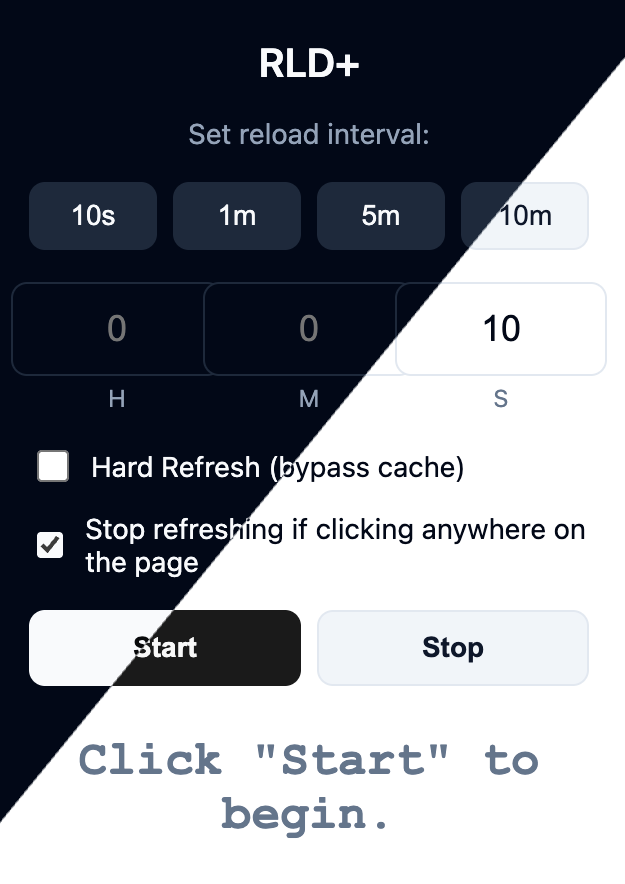

# RLD+

RLD+ is a simple yet powerful Chrome extension designed to automatically reload any website at a specified interval. It offers second-level granularity, giving you precise control over your refresh rates. **Now with multi-tab support** – reload multiple tabs simultaneously, each with independent timers and settings!

## Features

- **Multi-Tab Support:** Set up independent reload timers for multiple tabs at once. Each tab maintains its own interval, hard refresh setting, and stop-on-click behavior.
- **Custom Reload Intervals:** Set any reload interval in seconds.
- **Visual Countdown:** The extension icon displays a live countdown timer, so you always know when the next reload will occur.
- **Management View:** View and control all active timers across tabs in one place. Access it by clicking the list icon in the popup header.
- **Tab Control Buttons:** In the management view, you can:
  - **Open Tab:** Switch to any tab with an active timer
  - **Start/Stop Timers:** Play or pause timers for specific tabs
  - **Remove Timers:** Delete timer configurations for tabs you no longer need
- **Simple Interface:** An easy-to-use popup to start and stop the reloading process.
- **Dark/Light Mode Support:** Automatically adapts to your system's dark or light mode preference for a seamless visual experience.

## How to Use

### Single Tab Mode

  

1.  Click on the RLD+ extension icon in your Chrome toolbar.
2.  Set the desired reload interval using either the predefined buttons (10s, 1m, 5m, 10m) or by entering values into the Hours (H), Minutes (M), and Seconds (S) input fields.
3.  Click the **Start** button.
4.  The countdown will begin on the extension icon. The current tab will reload each time the countdown finishes.
5.  Optionally, check "Hard Refresh (bypass cache)" to force a full reload without using cached content.
6.  Optionally, check "Stop refreshing if clicking anywhere on the page" to automatically halt the reloading process if you interact with the page.
7.  To end the process, click the **Stop** button.

### Management View

1.  Click on the RLD+ extension icon in your Chrome toolbar.
2.  Click the **list icon** (☰) in the top-right corner of the popup to switch to the management view.
3.  You'll see all tabs with active or configured timers, showing:
    - Tab favicon and title
    - Status indicator (active or inactive)
    - Control buttons for each tab
4.  Use the control buttons to:
    - **Open Tab:** Click the external link icon to switch to that tab
    - **Start Timer:** Click the play button to activate a paused timer
    - **Stop Timer:** Click the stop button to pause an active timer
    - **Remove Timer:** Click the trash icon to completely remove the timer configuration
5.  Click the list icon again to return to the single tab view.

## Installation

1.  Download or clone this repository.
2.  Open Chrome and navigate to `chrome://extensions/`.
3.  Enable **Developer mode** in the top right corner.
4.  Click on **Load unpacked**.
5.  Select the directory where you saved the extension files.
6.  Pin the RLD+ icon to your toolbar for easy access.

## Deployment

To package the extension for the Chrome Web Store, follow these steps:

1.  **Update Version:** Before creating a new release, manually update the `version` field in `src/manifest.json` to a new, unique version number. The Chrome Web Store requires a higher version for each upload.

2.  **Run Deploy Script:** Run the `deploy.sh` script from the project root. You can use flags to control how the version is incremented.

    - `./deploy.sh`: (Default) Increments the patch version (e.g., 1.0.0 -> 1.0.1).
    - `./deploy.sh --minor`: Increments the minor version (e.g., 1.0.1 -> 1.1.0).
    - `./deploy.sh --major`: Increments the major version (e.g., 1.1.0 -> 2.0.0).
    - `./deploy.sh --version "x.y.z"`: Sets a specific version.
    - `./deploy.sh --no-version`: Packages without changing the version.

3.  **Upload to Store:** The script will generate a `rld-plus-v<version>.zip` file in the project root. Upload this file to the Chrome Web Store Developer Dashboard.
