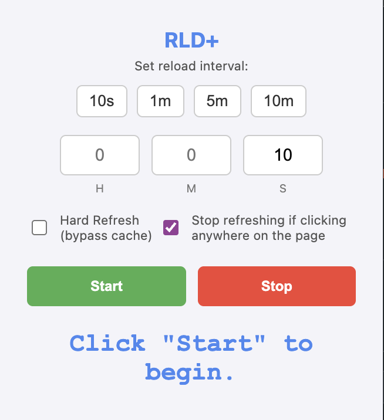

# RLD+

RLD+ is a simple yet powerful Chrome extension designed to automatically reload any website at a specified interval. It offers second-level granularity, giving you precise control over your refresh rates.

## Features

- **Custom Reload Intervals:** Set any reload interval in seconds.
- **Visual Countdown:** The extension icon displays a live countdown timer, so you always know when the next reload will occur.
- **Simple Interface:** An easy-to-use popup to start and stop the reloading process.
- **Efficient:** Uses Chrome's `alarms` API for reliable and battery-friendly timing.

## How to Use

1.  Click on the RLD+ extension icon in your Chrome toolbar.
2.  Set the desired reload interval using either the predefined buttons (10s, 1m, 5m, 10m) or by entering values into the Hours (H), Minutes (M), and Seconds (S) input fields.
3.  Click the **Start** button.
4.  The countdown will begin on the extension icon. The current tab will reload each time the countdown finishes.
5.  Optionally, check "Hard Refresh (bypass cache)" to force a full reload without using cached content.
6.  Optionally, check "Stop refreshing if clicking anywhere on the page" to automatically halt the reloading process if you interact with the page.
7.  To end the process, click the **Stop** button.

## Installation

1.  Download or clone this repository.
2.  Open Chrome and navigate to `chrome://extensions/`.
3.  Enable **Developer mode** in the top right corner.
4.  Click on **Load unpacked**.
5.  Select the directory where you saved the extension files.
6.  Pin the RLD+ icon to your toolbar for easy access.